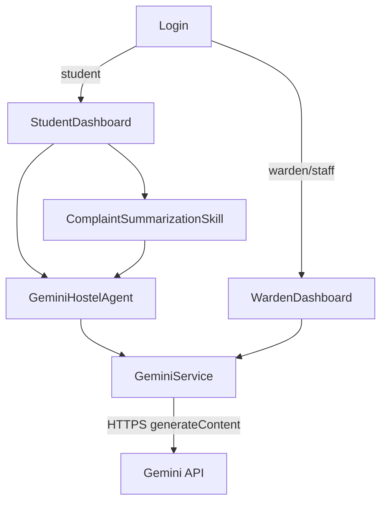

# Architecture

## Overview

Hostel Complaint Portal is a desktop Java Swing application. `Login` opens either the student workspace or the warden workspace. The dashboards currently use in-memory sample data for their cards, lists, and complaint displays; there is no database or authentication backend.

## Components



- `APP/Login.java` is the application entry point. It renders the login screen and routes a student to `StudentDashboard` or staff to `WardenDashboard`.
- `APP/StudentDashboard.java` provides the student dashboard, complaint form, notices, feedback, and a floating assistant. Its assistant uses `GeminiHostelAgent`; its complaint form exposes the complaint summarization skill.
- `APP/WardenDashboard.java` provides the staff workspace, in-memory complaint management views, analytics, and an AI drawer. When configured, the AI drawer calls `GeminiService`; otherwise it retains its local suggestion behavior.
- `APP/GeminiHostelAgent.java` supplies student-focused prompts and delegates all remote work to `GeminiService`.
- `APP/ComplaintSummarizationSkill.java` validates complaint text and asks the custom agent for a concise structured summary.

## Gemini flow

The UI starts a `SwingWorker`, so network work does not block Swing's event thread. The custom agent/skill provides a constrained prompt, then `GeminiService.askGemini` sends it to the `gemini-2.5-flash` `generateContent` endpoint. The service uses Java `HttpURLConnection`, UTF-8 request bodies, and manual regular-expression JSON string extraction—there is no Gson use in the source. It returns a safe user-facing message for a missing key, HTTP error, empty/malformed response, or network failure.

## Dependencies and Java version

The application builds with the Java standard library only and targets Java 17. The checked working tree contains an untracked `APP/lib/gson-2.10.1.jar`, but no Java source imports Gson and the build does not require it. It is intentionally not used or documented as a runtime dependency.

## Directory structure

```text
Hostel Compalin/
  APP/                         Java source files
  Icon/                        UI image assets
  out/                         local generated output (ignored)
.github/workflows/build.yml    compilation and local validation CI
```

## Build and run

From the repository root:

```powershell
Set-Location 'Hostel Compalin'
javac --release 17 -d build APP\*.java
java -cp build Login
```

Run the application from `Hostel Compalin` so relative `Icon` paths resolve. A graphical desktop is required.

## Configuration and security

Gemini is optional for compilation and UI startup. To enable live responses, set the `GEMINI_API_KEY` environment variable in the shell before launching the application. The key is never stored in the repository. The service does not log request URLs, responses, or exception details that could expose credentials.

## Limitations and improvements

Login authentication and dashboard records are demonstrative in-memory UI data. Complaint submission, file upload, notifications, authorization, and dashboard updates are not backed by persistent services. Future work should add a secure backend, validated identity and role management, persistent complaint storage, proper JSON parsing, test coverage, and configurable asset paths.
